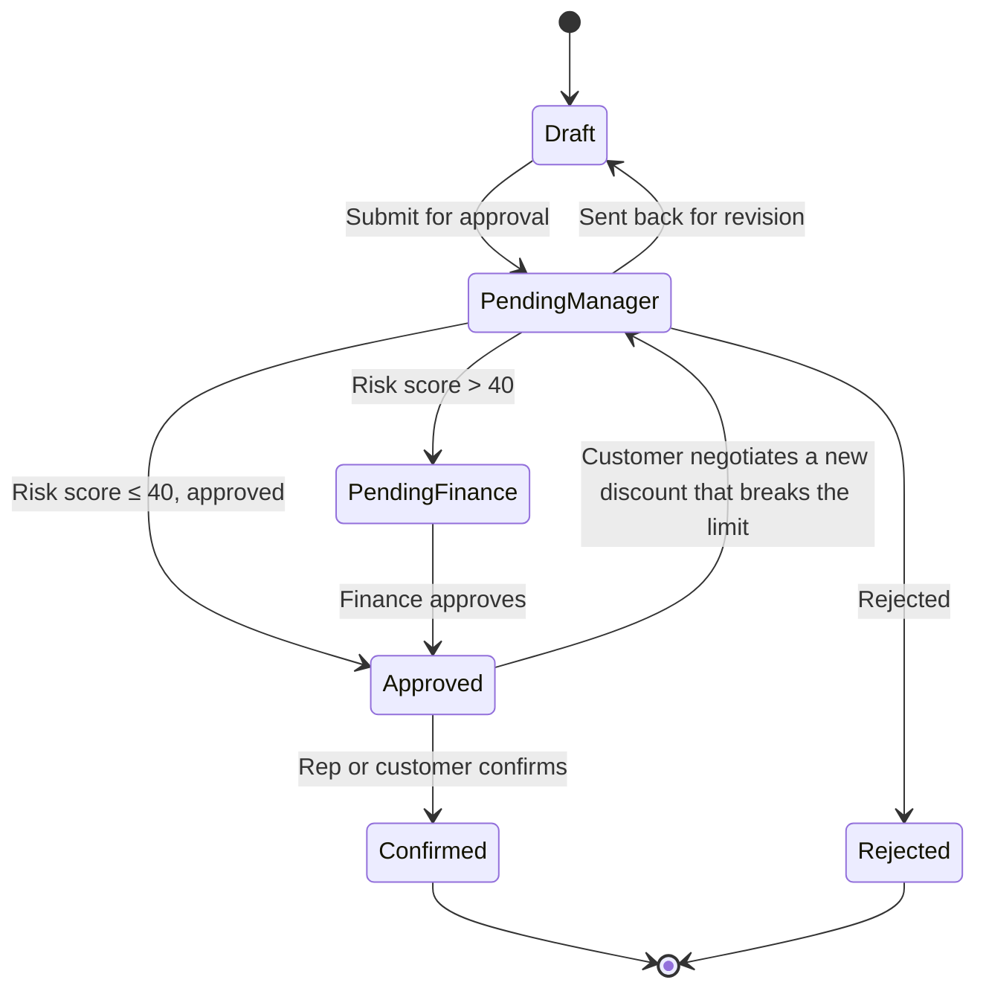
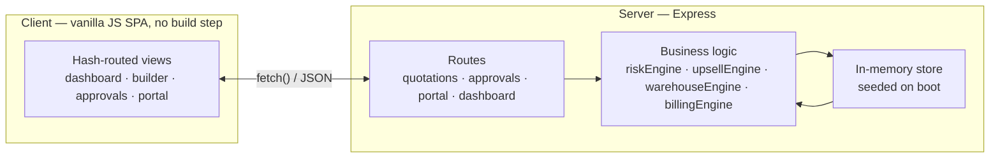

<div align="center">


<br/><br/>


[Quick start](#quick-start) • [Features](#features-at-a-glance) • [Screenshots](#screenshots) • [How it thinks](#how-it-thinks) • [Lifecycle](#quotation-lifecycle) • [Architecture](#architecture) • [API reference](#api-reference) • [Demo script](#demo-script)

</div>

<br/>

## What this is

Most sales tools do the basics fine: make a quote, confirm an order, send an invoice. Real B2B sales is messier than that — discounts need sign-off, stock is split across warehouses, some products are one-time and some are subscriptions, and customers want to negotiate instead of emailing back and forth for a week.

**DealFlow360** handles that mess automatically. As a rep builds a quotation, it checks whether the discount is too high, sends it to the right approver if it is, suggests useful add-ons, works out how to fulfil it from stock, and lets the customer negotiate — without ever letting them sneak past the approval rules.

Nothing here is hardcoded. Every number you see on screen is calculated live from the data — that's what the next section shows.

<br/>

## Features at a glance

| | |
|---|---|
| 🚦 **Discount risk engine** | Flags any discount that breaks the rules, and says exactly why |
| ✅ **Automatic approvals** | Routes to a Manager, or Manager + Finance, based on how risky the deal is |
| 🤖 **Upsell suggestions** | Recommends add-ons with real margin numbers, not random guesses |
| 📦 **Warehouse splitting** | Works out which warehouse ships what, and flags backorders |
| 💳 **Mixed billing** | Keeps one-time purchases and recurring subscriptions straight on one order |
| 🤝 **Customer negotiation** | A separate portal where customers can push back on price — safely |
| 📊 **Live dashboard** | Pipeline value, risk levels, and stalled deals, updated in real time |
| 📝 **Audit trail** | Every change is logged — who did what, and when |

<br/>

## Screenshots

<table>
<tr>
<td width="38%">

**Sign in**
Three role-based experiences — Sales Rep, Sales Manager, Finance — each seeing only what's relevant to them.


</td>
<td width="62%">

**Dashboard**
Live KPIs, deal health distribution, and anomaly alerts — all computed from the current state of every quotation, not static numbers.


</td>
</tr>
<tr>
<td width="100%" colspan="2">

**Quotation Builder** — the centerpiece screen
Add a discount that breaks the category limit and watch the risk score, reason, and approval requirement update instantly. The AI upsell panel on the right recalculates margin the moment a suggestion is added.


</td>
</tr>
<tr>
<td width="55%">

**Approval Center**
Every quotation waiting on a decision, with the exact reason it was flagged shown inline — no digging required before approving, rejecting, or sending it back for revision.


</td>
<td width="45%">

**Customer Negotiation Portal**
A genuinely separate, restricted view. When a customer requests a bigger discount, the risk engine re-runs live — if it breaks the threshold, the deal is kicked back into approval automatically, with no way around it.


</td>
</tr>
</table>

<br/>

## Quick start

```bash
cd server
npm start
```

Open **http://localhost:4000**. That's it.

> No `npm install` needed — dependencies are already bundled in `node_modules/`. No `.env` file, no database to provision, no seed script to run separately. The moment the server boots, four customers, seven products, three warehouses, and two in-flight quotations are ready to go.

**Requirements:** Node.js 18 or later. Nothing else.

<br/>

## How it thinks

This is the part most hackathon demos fake with a hardcoded label. Here it's real math, and it's simple once you see it laid out:


**In plain terms:** each product category (Hardware, Service, Subscription) has its own maximum discount. Each customer tier (Bronze, Silver, Gold) has its own maximum too. A line item is only "safe" if it stays under *both* — whichever is stricter wins.

```
allowed% = min(tierLimit[customer.tier], categoryLimit[product.category])
overage  = max(0, givenDiscount - allowed%)
```

Add up the overage from every line and you get a risk score out of 100. That score decides what happens next:

| Risk score | What happens |
|---|---|
| 0 | Nothing — auto-approved, no one needs to look at it |
| 1 – 40 | Goes to the Sales Manager |
| 41 – 100 | Goes to the Sales Manager, then Finance |

Notice a Gold customer is "allowed" 15% overall — but the Installation Service line still gets flagged, because *its own* category limit is 10%. One bad line is enough to flag the whole quotation, even if everything else looks fine. That's the point: a rep can't hide a risky discount inside an otherwise healthy order.

### Everything else that's real, not decorative

| Feature | What's actually computed |
|---|---|
| **AI upsell panel** | Margin impact = `product.price - product.cost` for each suggestion, ranked by seeded confidence. Suggestions disappear once added, and the deal's margin recalculates. |
| **Warehouse split** | Greedy allocation across warehouses ordered by preference, pulling from real per-warehouse stock counts. Backorders are calculated, not assumed. |
| **Hybrid billing** | Lines are split into one-time vs. recurring by product type, with a computed next billing date based on frequency. |
| **Customer negotiation** | A counter-discount request re-invokes the same risk engine the rep's builder uses. Same function, same rules — a customer cannot get a better deal than governance allows. |
| **Audit trail** | Every discount change, submission, approval, rejection, and negotiation writes a real log entry with user, action, timestamp, and old/new values. |

<br/>

## Quotation lifecycle

Every quotation moves through the same states, no matter how it gets there — a rep submitting it or a customer negotiating it both feed into the exact same flow:



The loop back from **Approved** to **Pending Manager** is the important one — it's what stops a customer from negotiating their way around the risk engine from the portal.

<br/>

## Architecture



The business logic layer has **zero dependency on Express** — `riskEngine.js`, `upsellEngine.js`, `warehouseEngine.js`, and `billingEngine.js` are pure functions that take data in and return data out. That's deliberate: it means the same risk calculation used by the rep's quotation builder is the exact function re-run when a customer negotiates from the portal, and it means swapping the in-memory store for a real database later only touches `store.js` — nothing in `logic/` or `routes/` needs to change.

<br/>

## Project structure

```
dealflow360/
├── README.md
├── docs/
│   └── screenshots/              Images used in this README
├── server/                       Express API + static file server
│   ├── index.js                   Entry point — mounts routes, serves /client
│   ├── store.js                   In-memory data store + audit helper
│   ├── data/
│   │   └── seed.js                Customers, products, warehouses, discount tiers, seed quotations
│   ├── logic/                     Pure business logic — no Express dependency
│   │   ├── riskEngine.js            Blended discount risk + approval routing
│   │   ├── upsellEngine.js          Co-purchase recommendation matching
│   │   ├── warehouseEngine.js       Stock allocation + backorder detection
│   │   └── billingEngine.js         One-time vs. recurring split
│   └── routes/
│       ├── masterData.js          Customers / products / warehouses
│       ├── quotations.js          Quotation CRUD, submit, warehouse split, confirm
│       ├── approvals.js           Approval center actions
│       ├── portal.js              Customer-facing negotiation endpoints
│       └── dashboard.js           Aggregated KPIs and alerts
└── client/                        No-build vanilla JS SPA
    ├── index.html
    ├── css/
    │   └── styles.css              Design system — dark theme, teal/violet accents
    └── js/
        ├── api.js                  Fetch wrapper for the API
        └── app.js                  Hash-routed views
```

<br/>

## Tech stack

| Layer | Choice | Why |
|---|---|---|
| Backend runtime | Node.js (ES modules) | Zero-friction setup, judges can run it anywhere |
| Backend framework | Express 4 | Minimal, well-understood, fast to wire up in a time crunch |
| Data layer | In-memory JS objects | No install/provision step; swappable behind `store.js` later |
| Frontend | Vanilla JS, ES modules | No bundler, no build step — open the file, it runs |
| Routing | Hand-rolled hash router | ~30 lines, no library needed for 5 views |
| Styling | Hand-written CSS, custom properties | Full control over the dark theme, no framework CSS to fight |
| Fonts | Space Grotesk, Inter, JetBrains Mono (Google Fonts) | Distinct type roles for headings, body, and data |

No database, no ORM, no auth library, no TypeScript, no test framework, no CSS framework — all intentional scope cuts for a 24-hour build, documented below.

<br/>

## API reference

<details>
<summary><strong>Master data</strong></summary>

| Method | Path | Description |
|---|---|---|
| GET | `/api/customers` | List all customers |
| GET | `/api/products` | List all products |
| GET | `/api/warehouses` | List all warehouses with stock |

</details>

<details>
<summary><strong>Quotations</strong></summary>

| Method | Path | Description |
|---|---|---|
| GET | `/api/quotations` | List all quotations with summary + risk |
| GET | `/api/quotations/:id` | Full detail — evaluation, upsell, billing, audit log |
| POST | `/api/quotations` | Create a draft `{ customerId }` |
| POST | `/api/quotations/:id/lines` | Add a line `{ productId, qty, discount }` |
| PATCH | `/api/quotations/:id/lines/:lineId` | Update qty/discount |
| DELETE | `/api/quotations/:id/lines/:lineId` | Remove a line |
| POST | `/api/quotations/:id/upsell/:productId` | Accept an AI recommendation |
| POST | `/api/quotations/:id/submit` | Run risk engine, route for approval or auto-approve |
| POST | `/api/quotations/:id/warehouse-split/accept` | Compute and accept the fulfillment split |
| POST | `/api/quotations/:id/confirm` | Confirm order, mark invoice paid |

</details>

<details>
<summary><strong>Approvals</strong></summary>

| Method | Path | Description |
|---|---|---|
| GET | `/api/approvals` | List quotations pending a decision |
| POST | `/api/approvals/:id/decide` | `{ decision: "approve" \| "reject" \| "revise", role, reason }` |

</details>

<details>
<summary><strong>Customer portal</strong></summary>

| Method | Path | Description |
|---|---|---|
| GET | `/api/portal/:id` | Customer-safe view of a quotation |
| POST | `/api/portal/:id/negotiate` | `{ lineId, requestedDiscount, comment }` — re-runs the risk engine |
| POST | `/api/portal/:id/confirm` | Customer confirms an approved quotation |

</details>

<details>
<summary><strong>Dashboard</strong></summary>

| Method | Path | Description |
|---|---|---|
| GET | `/api/dashboard` | KPIs, deal health split, alerts, pipeline-by-stage |

</details>

<br/>

## Demo script

This mirrors the official 8-step test flow — run it end to end before presenting.

1. **Login** as Sales Representative → lands on the Dashboard.
2. **Quotations → + New Quotation** → pick a Gold-tier customer (ABC Corp or Global Systems).
3. Add **Enterprise Laptop**, qty 10, 12% discount → stays `SAFE`.
4. Add **Installation Service**, qty 1, **18%** discount → instantly flagged `OVER LIMIT`, risk panel updates live with the reason.
5. Accept an **AI upsell suggestion** (e.g. Extended Warranty) → total and margin update immediately.
6. Click **Submit for Approval** → quotation routes automatically.
7. Switch role to **Sales Manager** → **Approvals** → approve (escalates to Finance if risk is high enough — approve again as Finance).
8. Back on the quotation, click **Compute Warehouse Split** → see live stock allocation.
9. Copy the **Portal Link**, open it as the **customer**, request a bigger discount on a line.
10. Watch it **automatically re-enter the approval workflow** → go re-approve it.
11. Back in the portal, click **Confirm Quotation**.
12. Return to the **Dashboard** — deal health, pipeline counts, and alerts all reflect the change in real time.

<br/>

## Scope notes

Built for a 24-hour window — these were deliberate cuts, not oversights:

- **No persistent database.** State lives in memory and resets on restart. Swapping in Postgres/SQLite means rewriting `server/store.js` only — the routes and logic layers are already decoupled from storage.
- **No auth database.** Role selection on login is a UI-only demo switch.
- **No proration/refund/cancellation logic** for subscriptions, no multi-currency, no notifications system.
- **No admin UI** for editing discount tiers or approval chains — they're configured directly in `server/data/seed.js`.
- **Warehouse split only applies to physical (Hardware) line items** — services and subscriptions aren't warehouse-fulfilled, by design.

### What we'd build next

- Real persistence (Postgres) and JWT-based auth per role
- A trained recommendation model behind the upsell panel, replacing the seeded rules
- Subscription proration, cancellation, and credit-note logic
- Admin UI for discount tiers and approval chains
- Notifications (email/Slack) on approvals and stalled-deal alerts

<br/>

<div align="center">

Built for a 24-hour hackathon · No frameworks harmed in the making of this frontend

</div>
